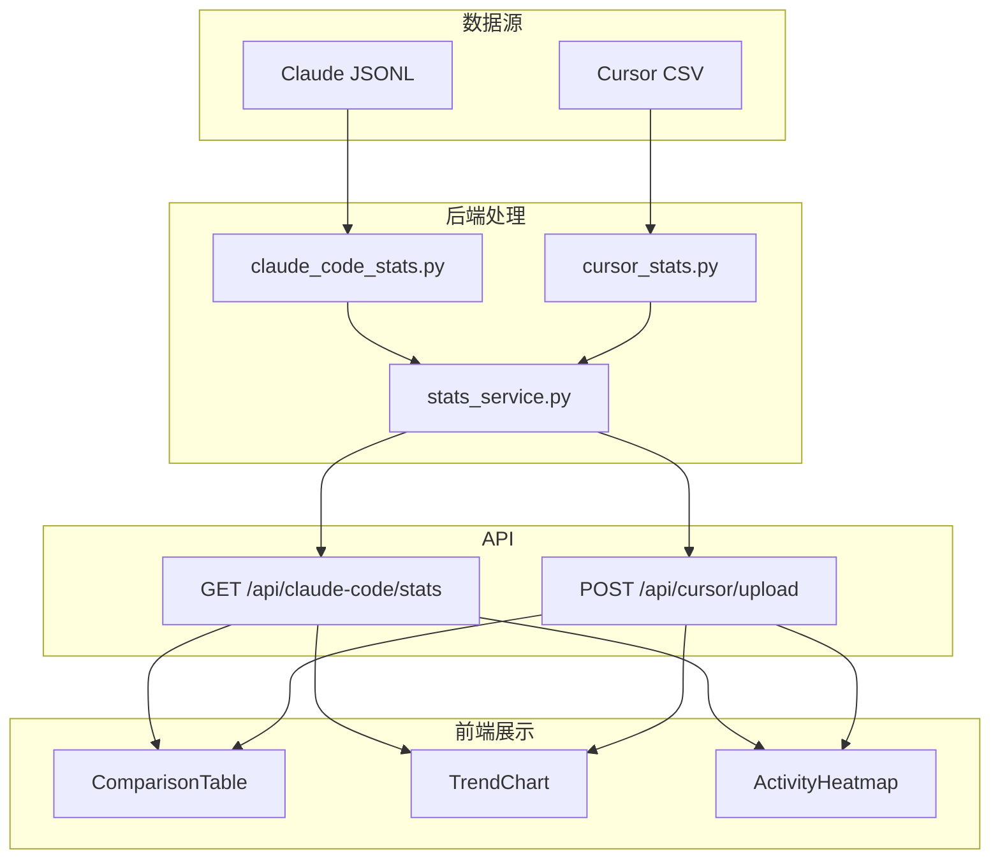

# 数据源详细说明

本文档展示实际数据的格式和示例。

---

## 1. Claude Code 原始数据

### 1.1 sessions-index.json 格式

路径: `~/.claude/projects/<project-hash>/sessions-index.json`

```json
{
  "entries": [
    {
      "sessionId": "abc123-def456-...",
      "created": "2026-01-28T08:00:00.000Z",
      "modified": "2026-01-28T10:30:00.000Z"
    },
    {
      "sessionId": "ghi789-jkl012-...",
      "created": "2026-01-29T09:00:00.000Z",
      "modified": "2026-01-29T18:00:00.000Z"
    }
  ]
}
```

### 1.2 会话 JSONL 文件格式

路径: `~/.claude/projects/<project-hash>/<session-id>.jsonl`

每行一个 JSON 对象，按时间顺序记录对话:

```jsonl
{"type":"summary","timestamp":"2026-01-28T08:00:00.000Z","summary":"用户在 summary 项目中工作"}
{"type":"user","timestamp":"2026-01-28T08:00:01.000Z","message":{"role":"user","content":"帮我分析这个文件"}}
{"type":"assistant","timestamp":"2026-01-28T08:00:05.000Z","requestId":"req_abc","message":{"role":"assistant","model":"claude-opus-4-5-20251101","content":[{"type":"text","text":"好的，让我分析..."}],"usage":{"input_tokens":2000,"output_tokens":500,"cache_creation_input_tokens":80000,"cache_read_input_tokens":0}}}
{"type":"user","timestamp":"2026-01-28T08:01:00.000Z","message":{"role":"user","content":"继续"}}
{"type":"assistant","timestamp":"2026-01-28T08:01:05.000Z","requestId":"req_def","message":{"role":"assistant","model":"claude-opus-4-5-20251101","content":[{"type":"text","text":"接下来..."}],"usage":{"input_tokens":1500,"output_tokens":800,"cache_creation_input_tokens":0,"cache_read_input_tokens":82000}}}
```

### 1.3 usage 字段详解

```json
{
  "usage": {
    "input_tokens": 1500,
    "output_tokens": 800,
    "cache_creation_input_tokens": 0,
    "cache_read_input_tokens": 82000
  }
}
```

**字段说明**:

| 字段 | 本次请求值 | 累计效果 |
|------|-----------|----------|
| `input_tokens` | 1500 | 本次新输入的 token，需要全额计费 |
| `output_tokens` | 800 | 本次输出的 token |
| `cache_creation_input_tokens` | 0 | 本次写入缓存的 token（首次请求时较大） |
| `cache_read_input_tokens` | 82000 | 本次从缓存读取的 token（节省计费） |

**典型模式**:
- 第一次请求: `cache_creation` 很大，`cache_read` 为 0
- 后续请求: `cache_creation` 很小或为 0，`cache_read` 很大

---

## 2. Cursor CSV 数据

### 2.1 CSV 文件示例

```csv
Date,User,Kind,Model,Max Mode,Input (w/ Cache Write),Input (w/o Cache Write),Cache Read,Output Tokens,Total Tokens,Requests
2026-01-28T10:00:00Z,alice@company.com,On-Demand,claude-3-5-sonnet-20241022,false,5000,3000,50000,1000,56000,1
2026-01-28T10:05:00Z,alice@company.com,On-Demand,claude-3-5-sonnet-20241022,false,4500,2500,52000,800,57300,1
2026-01-28T10:10:00Z,alice@company.com,Errored,claude-3-5-sonnet-20241022,false,1000,1000,0,0,1000,0.5
2026-01-29T09:00:00Z,alice@company.com,On-Demand,gpt-4o,false,3000,3000,0,500,3500,1
```

### 2.2 字段说明

| 列名 | 示例值 | 说明 |
|------|--------|------|
| `Date` | `2026-01-28T10:00:00Z` | ISO 8601 时间戳 |
| `User` | `alice@company.com` | 用户邮箱 |
| `Kind` | `On-Demand` | 请求类型: On-Demand(正常), Errored(错误), No Charge(免费) |
| `Model` | `claude-3-5-sonnet-20241022` | 使用的模型 |
| `Max Mode` | `false` | 是否使用 Max 模式 |
| `Input (w/ Cache Write)` | `5000` | 输入 token 含缓存写入 |
| `Input (w/o Cache Write)` | `3000` | 输入 token 不含缓存写入 |
| `Cache Read` | `50000` | 从缓存读取的 token |
| `Output Tokens` | `1000` | 输出 token |
| `Total Tokens` | `56000` | 总 token |
| `Requests` | `1` | 请求数（可能是小数） |

### 2.3 Kind 字段过滤

统计时只计算 `Kind = On-Demand` 的记录:
- `On-Demand`: 正常计费请求 ✓ 统计
- `Errored`: 错误请求 ✗ 跳过
- `No Charge`: 不计费请求 ✗ 跳过

---

## 3. 统计输出格式

### 3.1 Claude Code 统计输出

```json
{
  "metadata": {
    "generated_at": "2026-01-30T12:00:00.000000",
    "start_date": "2026-01-27T00:00:00+00:00",
    "end_date": "2026-01-30T23:59:59.999999+00:00",
    "username": "admin",
    "machine": "MacBook-Pro.local"
  },
  "summary": {
    "total_input_tokens": 115938,
    "total_output_tokens": 2651,
    "total_cache_creation_tokens": 4121765,
    "total_cache_read_tokens": 110218047,
    "total_tokens": 118589,
    "total_tokens_with_cache": 114458401,
    "total_sessions": 15,
    "total_user_messages": 157,
    "total_assistant_messages": 9,
    "total_tool_calls": 0,
    "active_days": 3,
    "active_projects": 4
  },
  "by_model": {
    "claude-opus-4-5-20251101": {
      "input_tokens": 115938,
      "output_tokens": 2651,
      "cache_creation_input_tokens": 4121765,
      "cache_read_input_tokens": 110218047,
      "requests": 157
    }
  },
  "by_day": {
    "2026-01-28": {
      "input_tokens": 63572,
      "output_tokens": 991,
      "cache_creation_input_tokens": 1500000,
      "cache_read_input_tokens": 43373947,
      "total_tokens_with_cache": 44938510
    },
    "2026-01-29": {
      "input_tokens": 47903,
      "output_tokens": 1074,
      "cache_creation_input_tokens": 1200000,
      "cache_read_input_tokens": 42120929,
      "total_tokens_with_cache": 43369906
    },
    "2026-01-30": {
      "input_tokens": 4463,
      "output_tokens": 586,
      "cache_creation_input_tokens": 1421765,
      "cache_read_input_tokens": 24723171,
      "total_tokens_with_cache": 26149985
    }
  },
  "by_project": {
    "-Users-admin-Projects-summary-": {
      "input_tokens": 100000,
      "output_tokens": 2000,
      "sessions": 10
    }
  }
}
```

### 3.2 Cursor 统计输出

```json
{
  "metadata": {
    "generated_at": "2026-01-30T12:00:00.000000",
    "start_date": "2026-01-27T00:00:00+00:00",
    "end_date": "2026-01-30T23:59:59.999999+00:00",
    "username": "admin",
    "machine": "MacBook-Pro.local",
    "source": "cursor",
    "csv_files": ["/tmp/upload.csv"]
  },
  "summary": {
    "input_tokens_with_cache": 8340000,
    "input_tokens_without_cache": 5200000,
    "cache_read_tokens": 56440000,
    "output_tokens": 640800,
    "total_tokens": 67160000,
    "requests": 2671.9,
    "records": 2500,
    "errored_records": 50,
    "active_days": 4,
    "users_count": 1
  },
  "by_model": {
    "claude-3-5-sonnet-20241022": {
      "input_tokens_with_cache": 7000000,
      "total_tokens": 55000000,
      "requests": 2000,
      "records": 1800
    },
    "gpt-4o": {
      "input_tokens_with_cache": 1340000,
      "total_tokens": 12160000,
      "requests": 671.9,
      "records": 700
    }
  },
  "by_day": {
    "2026-01-27": {
      "input_tokens_with_cache": 2500000,
      "output_tokens": 200000,
      "total_tokens": 20000000,
      "requests": 800,
      "records": 750
    },
    "2026-01-28": {
      "input_tokens_with_cache": 3000000,
      "output_tokens": 250000,
      "total_tokens": 25000000,
      "requests": 900,
      "records": 850
    }
  },
  "by_user": {
    "alice@company.com": {
      "total_tokens": 67160000,
      "requests": 2671.9
    }
  }
}
```

---

## 4. 数据流图



---

## 5. 关键代码片段

### 5.1 Claude Code Token 累加逻辑

```python
# claude_code_stats.py - analyze_jsonl_file()

if usage:
    input_tokens = usage.get("input_tokens", 0)
    output_tokens = usage.get("output_tokens", 0)
    cache_creation = usage.get("cache_creation_input_tokens", 0)
    cache_read = usage.get("cache_read_input_tokens", 0)

    # 累加到总计
    stats["input_tokens"] += input_tokens
    stats["output_tokens"] += output_tokens
    stats["cache_creation_input_tokens"] += cache_creation
    stats["cache_read_input_tokens"] += cache_read

    # 按天统计
    day = timestamp.date().isoformat()
    stats["by_day"][day]["input_tokens"] += input_tokens
    stats["by_day"][day]["output_tokens"] += output_tokens
    stats["by_day"][day]["cache_creation_input_tokens"] += cache_creation
    stats["by_day"][day]["cache_read_input_tokens"] += cache_read
```

### 5.2 Cursor Token 累加逻辑

```python
# cursor_stats.py - analyze_csv()

input_with_cache = parse_number(row.get("Input (w/ Cache Write)", "0"))
input_without_cache = parse_number(row.get("Input (w/o Cache Write)", "0"))
cache_read = parse_number(row.get("Cache Read", "0"))
output_tokens = parse_number(row.get("Output Tokens", "0"))
total_tokens = parse_number(row.get("Total Tokens", "0"))

# 累加
stats["input_tokens_with_cache"] += input_with_cache
stats["input_tokens_without_cache"] += input_without_cache
stats["cache_read_tokens"] += cache_read
stats["output_tokens"] += output_tokens
stats["total_tokens"] += total_tokens
```

### 5.3 前端对比取值

```typescript
// ComparisonTable.tsx

const rows = [
  {
    metric: 'Token 总量',
    // Claude Code: 使用 total_tokens_with_cache (含所有缓存)
    claudeCode: ccSummary?.total_tokens_with_cache ?? 0,
    // Cursor: 使用 total_tokens (也含缓存)
    cursor: cuSummary?.total_tokens ?? 0,
  },
  // ...
];
```
