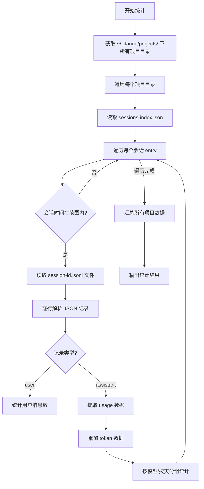
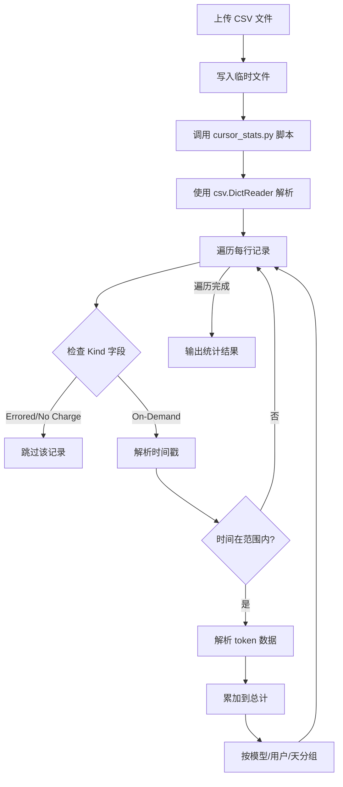
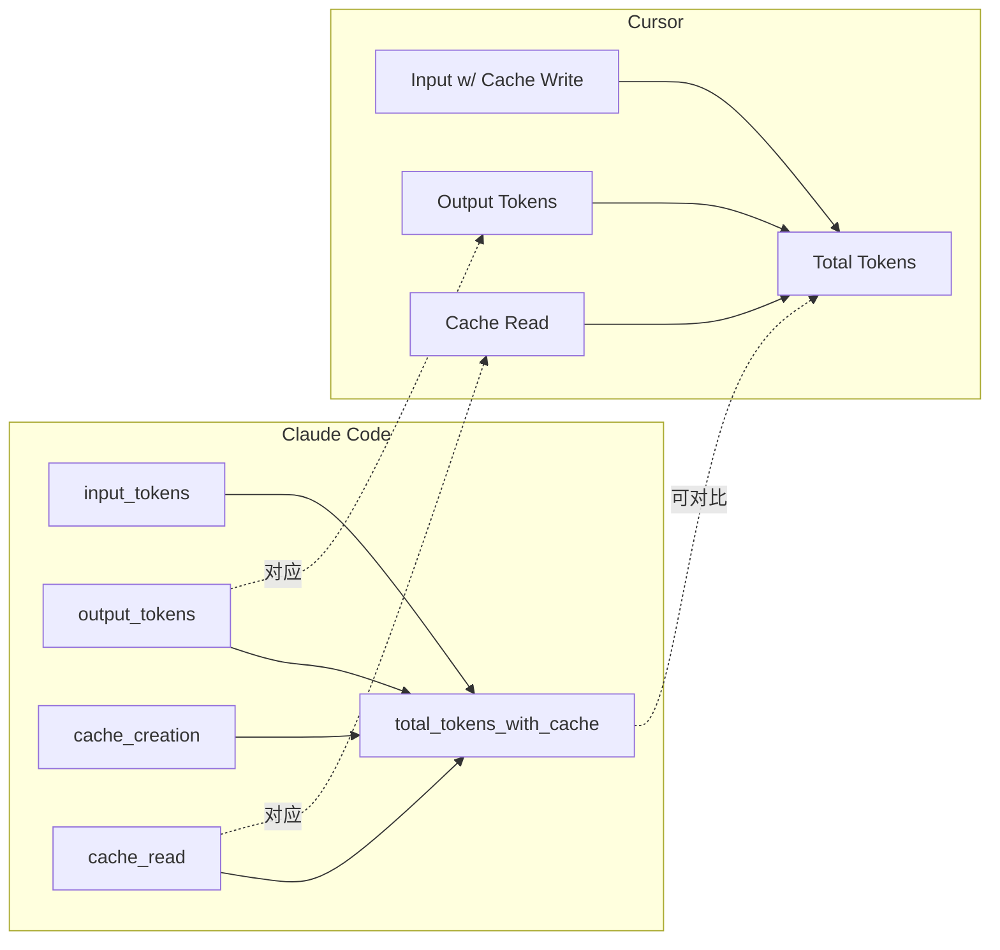

# 统计数据计算说明

本文档详细解释 Claude Code 和 Cursor 的用量统计方法、数据来源和字段含义。

---

## 1. Claude Code 数据统计

### 1.1 数据来源

Claude Code 的使用数据存储在本地 `~/.claude/` 目录下：

```
~/.claude/
├── projects/
│   ├── <project-hash-1>/
│   │   ├── sessions-index.json    # 会话索引
│   │   ├── <session-id-1>.jsonl   # 会话详细记录
│   │   └── <session-id-2>.jsonl
│   └── <project-hash-2>/
│       └── ...
└── stats-cache.json               # 全局统计缓存（未使用）
```

### 1.2 数据采集流程



### 1.3 JSONL 文件格式

每个 `.jsonl` 文件包含会话中的所有消息，每行一个 JSON 对象：

#### 用户消息 (type: "user")
```json
{
  "type": "user",
  "timestamp": "2026-01-30T10:30:00.000Z",
  "message": {
    "role": "user",
    "content": "帮我写一个函数"
  }
}
```

#### 助手消息 (type: "assistant")
```json
{
  "type": "assistant",
  "timestamp": "2026-01-30T10:30:05.000Z",
  "requestId": "req_abc123",
  "message": {
    "role": "assistant",
    "model": "claude-opus-4-5-20251101",
    "content": [...],
    "usage": {
      "input_tokens": 1500,
      "output_tokens": 500,
      "cache_creation_input_tokens": 50000,
      "cache_read_input_tokens": 100000
    }
  }
}
```

### 1.4 Token 字段说明

| 字段 | 来源 | 含义 | 计费说明 |
|------|------|------|----------|
| `input_tokens` | API usage | 实际新输入的 token 数（不含缓存读取） | 按标准价格计费 |
| `output_tokens` | API usage | 模型生成的输出 token 数 | 按标准价格计费 |
| `cache_creation_input_tokens` | API usage | 首次写入缓存的 token 数 | 有额外写入成本 (1.25x) |
| `cache_read_input_tokens` | API usage | 从缓存读取的 token 数 | 有折扣 (0.1x，即 10% 成本) |

### 1.5 汇总字段计算

```python
# 每日统计 (by_day)
by_day[date] = {
    "input_tokens": sum(input_tokens),           # 当日新输入
    "output_tokens": sum(output_tokens),         # 当日输出
    "cache_creation_input_tokens": sum(...),     # 当日缓存写入
    "cache_read_input_tokens": sum(...),         # 当日缓存读取
    "total_tokens_with_cache": (                 # 当日全量 token
        input_tokens + output_tokens +
        cache_creation_input_tokens + cache_read_input_tokens
    )
}

# 总计 (summary)
summary = {
    "total_input_tokens": sum(all input_tokens),
    "total_output_tokens": sum(all output_tokens),
    "total_cache_creation_tokens": sum(all cache_creation),
    "total_cache_read_tokens": sum(all cache_read),

    # API Token (实际 API 调用消耗，不含缓存读取的折扣部分)
    "total_tokens": total_input_tokens + total_output_tokens,

    # 全量 Token (用于与 Cursor 对比，都包含缓存)
    "total_tokens_with_cache": (
        total_input_tokens + total_output_tokens +
        total_cache_creation_tokens + total_cache_read_tokens
    )
}
```

### 1.6 重要说明

1. **去重机制**: 使用 `requestId` 避免重复计算同一请求的 token（流式响应会产生多条记录）
2. **时间范围过滤**: 只统计 `timestamp` 在指定范围内的记录
3. **缓存比例**: 由于 Claude Code 大量使用提示缓存，`cache_read_input_tokens` 通常占比很高

---

## 2. Cursor 数据统计

### 2.1 数据来源

Cursor 数据来自用户手动导出的 CSV 文件：
- 路径: Cursor Settings > Usage > Export CSV

### 2.2 CSV 文件格式

```csv
Date,User,Kind,Model,Max Mode,Input (w/ Cache Write),Input (w/o Cache Write),Cache Read,Output Tokens,Total Tokens,Requests
2026-01-30T10:30:00Z,user@example.com,On-Demand,claude-3-5-sonnet-20241022,false,5000,3000,50000,1000,56000,1.0
```

### 2.3 数据采集流程



### 2.4 CSV 字段说明

| CSV 列名 | 含义 | 对应统计字段 |
|----------|------|--------------|
| `Date` | 请求时间戳 (ISO 格式) | 用于时间过滤和按天分组 |
| `User` | 用户邮箱 | 用于按用户分组 |
| `Kind` | 请求类型 | On-Demand=正常, Errored=错误, No Charge=不计费 |
| `Model` | 使用的模型名称 | 用于按模型分组 |
| `Input (w/ Cache Write)` | 输入 token（含缓存写入） | `input_tokens_with_cache` |
| `Input (w/o Cache Write)` | 输入 token（不含缓存写入） | `input_tokens_without_cache` |
| `Cache Read` | 从缓存读取的 token | `cache_read_tokens` |
| `Output Tokens` | 输出 token | `output_tokens` |
| `Total Tokens` | 总 token 数 | `total_tokens` |
| `Requests` | 请求数（可能是小数，表示加权） | `requests` |

### 2.5 汇总字段计算

```python
# 每日统计 (by_day)
by_day[date] = {
    "input_tokens_with_cache": sum(...),   # 含缓存写入的输入
    "output_tokens": sum(...),             # 输出
    "total_tokens": sum(...),              # 总计（直接从 CSV 累加）
    "requests": sum(...),                  # 请求数
    "records": count,                      # 记录数
}

# 总计 (summary)
summary = {
    "input_tokens_with_cache": sum(all Input w/ Cache Write),
    "input_tokens_without_cache": sum(all Input w/o Cache Write),
    "cache_read_tokens": sum(all Cache Read),
    "output_tokens": sum(all Output Tokens),
    "total_tokens": sum(all Total Tokens),
    "requests": sum(all Requests),
    "records": count(all records),
    "errored_records": count(Errored/No Charge records),
    "active_days": count(unique dates),
}
```

---

## 3. 字段对比与映射

### 3.1 Token 对比表

| 统计维度 | Claude Code 字段 | Cursor 字段 | 说明 |
|----------|-----------------|-------------|------|
| **Token 总量** | `total_tokens_with_cache` | `total_tokens` | 两者都包含缓存，可直接对比 |
| **输入 Token (计费)** | `total_input_tokens` | `input_tokens_with_cache` | Claude 不含缓存读取，Cursor 含缓存写入 |
| **缓存写入** | `total_cache_creation_tokens` | `input_with - input_without` | Cursor 需计算差值 |
| **缓存读取** | `total_cache_read_tokens` | `cache_read_tokens` | 直接对应 |
| **输出 Token** | `total_output_tokens` | `output_tokens` | 直接对应 |

### 3.2 对比关系图



---

## 4. 常见问题

### Q1: 为什么 Claude Code 的 input_tokens 很小，但 total_tokens_with_cache 很大？

**原因**: Claude Code 大量使用提示缓存。系统提示、工具定义、之前的对话历史都会被缓存。

```
典型数据示例:
- input_tokens:           115K   (新输入，很小)
- cache_read_input_tokens: 110M  (从缓存读取，很大)
- total_tokens_with_cache: 114M  (总计)
```

这是正常的，说明缓存机制工作良好，可以节省大量成本。

### Q2: 为什么之前 TrendChart 显示 Claude Code 为 0？

**原因**: 之前代码只统计 `input_tokens + output_tokens`（约 118K），而 Cursor 统计 `total_tokens`（约 67M）。
两者数量级差距太大，导致 Claude Code 在图表中几乎不可见。

**修复**: 现在使用 `total_tokens_with_cache` 来统计 Claude Code，与 Cursor 的 `total_tokens` 口径一致。

### Q3: Cursor 的 Total Tokens 是如何计算的？

根据 CSV 格式推断:
```
Total Tokens ≈ Input (w/ Cache Write) + Cache Read + Output Tokens
```

但由于数据可能有舍入，实际可能略有差异。

### Q4: 缓存写入 Token 如何计算？

- **Claude Code**: 直接从 `cache_creation_input_tokens` 字段获取
- **Cursor**: `Input (w/ Cache Write) - Input (w/o Cache Write)`

---

## 5. 代码位置

| 功能 | 文件路径 |
|------|----------|
| Claude Code 统计脚本 | `backend/scripts/claude_code_stats.py` |
| Cursor 统计脚本 | `backend/scripts/cursor_stats.py` |
| 统计服务封装 | `backend/app/services/stats_service.py` |
| 对比表格组件 | `frontend/src/components/ComparisonTable.tsx` |
| 趋势图组件 | `frontend/src/components/TrendChart.tsx` |
| 活动热力图组件 | `frontend/src/components/ActivityHeatmap.tsx` |
